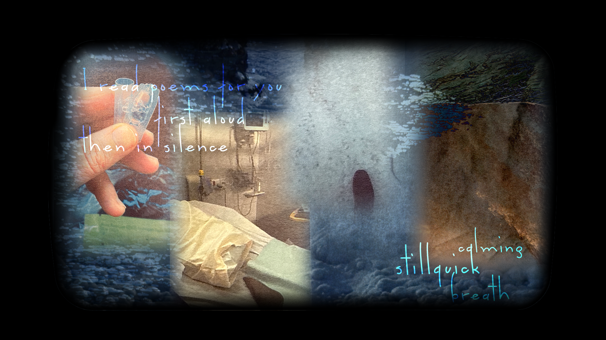
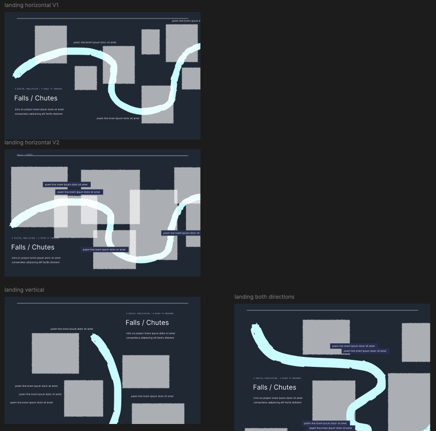
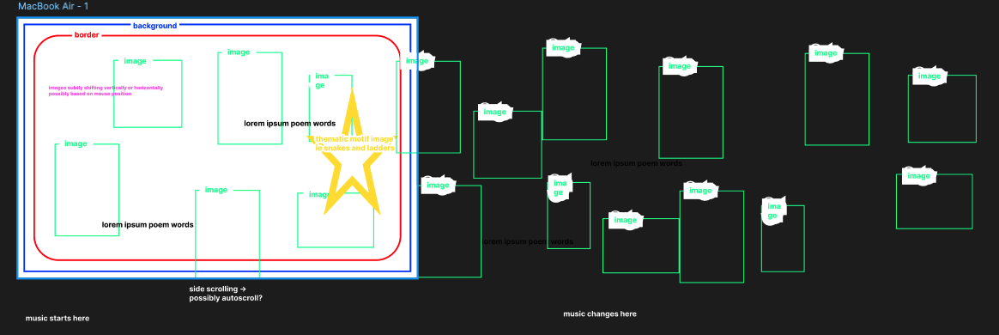
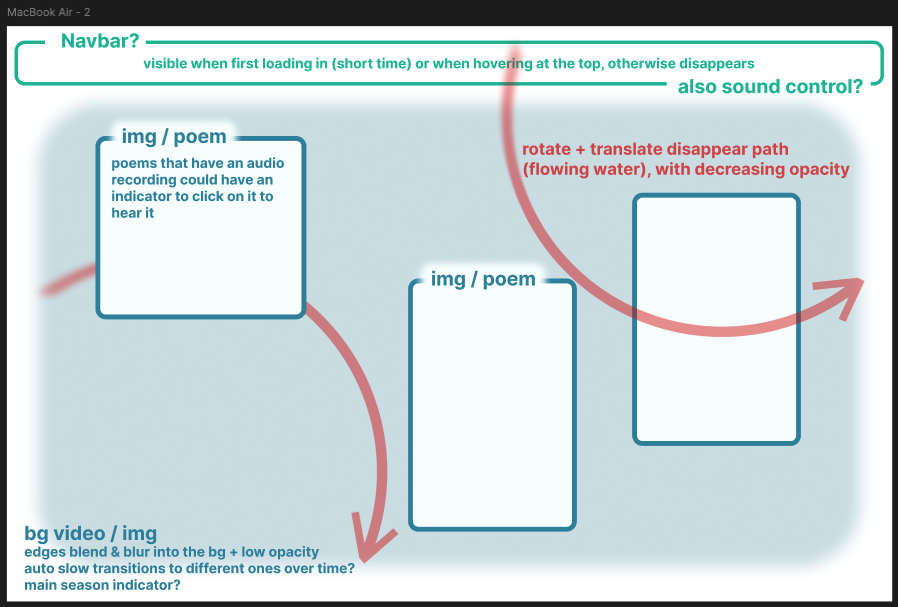
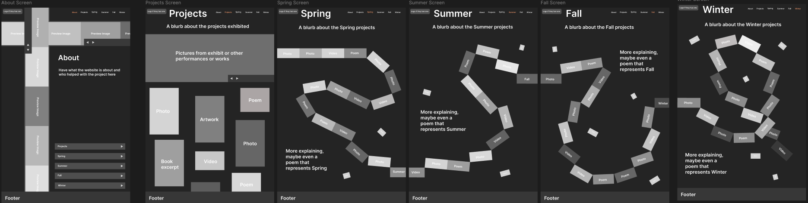

# Project Journal

#### TEAM G

Team: Mars Lapierre-Furtado, Michael Vlamis, Tatiana Désormeaux, Scarlett Perez, & Marjorie Dudemaine

*Client:* VK Preston

*Title:* Falls / Chutes

## Week 2

We looked over the project brief together. We all acknowledged that this is a very personal project to VK Preston since it is about their own personal experience being a caretaker for their father during COVID. We did an initial brainstorm where we discussed the format which is an interactive web experience with integrated video as a focal point of the project. We explored the idea of different experimental ways of interacting with it, like with cursor position, audio, voice recognition, webcam, subtle interactions by clicking of keywords from the poems and transcripts, etc. Something along the line of a point and click "game" but more experimental and avant-garde. We also went over our individual skills so we can have a list of team skills.

Since we felt like the briefing was somewhat vague, we went to speak with Sabine to get more information. We do indeed have a lot of creative freedom and discussed with Sabine different aesthetics / layout we could work with like have it be side scrolling, or layered visuals that you go deeper into possibly. The idea of creating or using some sort of voice recognition software is realistic but we are not comited to it yet. We also know now that we will have access to a lot of footage and audio and the vimeo we recieved is more of a taste.

The core concept of this project, explained by Sabine, is that it serves as documentation to make the public aware of the lack of support caregivers receive and the experience of taking care of someone alone when they are at the end of their life. It is coming at the issue from an activist perspective and opening a dialogue about how we can care for each other. 

We then decided to try to establish a realistic scope and a wish list. 

Realistic scope:

- interactive website prorotype
- continuous visuals
- audio integration
- functional
- accessible

Wish list:

- website fully done
- complex interaction for performance / exhibition
- generate something abstract by fusing the content and the user interactions

Michael created a beautiful art board to have at least a visual to show VK Preston and a starting point to see what their own vision is.

Finally we decided on some key questions we want to ask VK Preston next week but we will obviously ask more based on the answers and where the conversation leads:

- Do you already have a specific vision or aesthetic for this project?
- Is this meant to be stand alone or capable of being expanded in the future?
- Do you have specific inspiration for this (like specific websites)?
- Who is the intended audience? 
- What are you expectations from us this semester?
- What level of interactivity do you want / expect?
- How often would you like to do check-ins?
- What is the ideal schedule for this project?
- What is your preferred communication method?

## Week 3

We had our first client meeting with VK Preston to discuss the project. Here is the meeting recap:
- started with brief introduction of our skills & initial brainstorming ideas for the project:
    - continuous integration/mesh of images & videos
    - being able to scroll through the seasons
    - point-n-click "game" elements to reveal more of the story/info/context of the images
- Q1: what is expected of us after the next 12 weeks
    - have a functional but not necessarily published website
    - have it be updateable / adaptable for the upcoming Seasons
    - in addition to the Chutes / Seasons adaptation, include a page describing the team & narrative behind it (project brief)
    - possibility of further working with them afterwards, as well as research involvement(?)
- Q2: whether the website is a modular component of the whole Chutes/Seasons project or act more standalone
    - website would be more of a at-home experience of the Chutes/Seasons project
    - possibility of further adapting the website for lecture performance(s), with full-body motion for navigating (VK had an idea of using a theremin)
    - so kind of both in a way
- Q3: what inspiration VK has in terms of layout / UI
    - VK made a sequence in Miro that would be a good starting point for the website
    - definitely focus on the scrolling aspect, references to the Snakes & Ladders imagery
- Q4: the best time & means of checking-in / communications
    - wednesdays would be best for full check-ins / progress updates
    - texting is better than email (number is 647-323-5221, email is on project brief)
- Q5: what we should aim for for next week
    - adapt the Miro sequence into a more web-based format (possibly Figma)
    - a copy of the sequence will be made available to us ASAP for us to potentially edit/play with
- Visualization studio meetup) Sept. 30th 10:30, Library room 314 (meet them in class at 10 first)

I unfortunately had to miss class this week because I was feeling sick but my team filled me in on everything after. The meeting helped clarify a lot of things but with further reflection, has lead us to more questions. In brief, VK is expecting a live and functioning product at the end of the 12 weeks which feels very realistic as long as we remain organized and control the scope of the features we want to include.

Our main focus before week 4's class was the Living Learning Contract. We defined the project's focus and overall objectives. We also established our learning objectives and learning activities. We created a week by week schedule / plan with milestones that we hope to stick by mostly during this, but we are aware that unexpected events and changes might happen so we will stay flexible and adaptable. The team collaborated and communicated quite well all around, I feel quite optimistic. 

## Week 4

During class, we had another meeting with VK. We went to the visualization studio in the library and they further explained their project so we can have a clearer idea of their vision and the project as a whole. We also met Valentina Plata who is the composer who leads the project for Winter at the moment. The meeting allowed us to ask a lot of questions and clarify certain elements. VK still does not have a concrete vision for the web experience so we proposed to them that we would create a few concept wireframes for the layout and present them at our next meeting the following week with them.

__Meeting notes:__
- Concept: spiral (18 months in hostpital)
- 2 loops = hospital and waterfall
- two sides of same river , you walk out of the care home and walk this river , rivers and care constant -  moving in and out of care home
- Keep the spine but not linear
- Adaptable and open for other seasons
- Password protection for work in progress things / sections ?
- Integrate the raw sound (we have a lot)
- Interactive, tactile sounds ,
- What happens when VK speaks == idea ! Distortion visually on the website when we hear the poetry (either auto playing or  based on smt the user does without realizing or dmt the user does on purpose)
- Binoral version and 26.1 version of audio
- Snakes and ladders and healthcare system - linear progress and then something happens, you get a phone call and you’re back wards
- Pathways - traversing a route over and over but it’s also changing over time and seasons
- Euclydian motion of the water
- Everytime you interact it’s new ?
- Loops are poem length (written and audio integrated) (average 2-3 minutes per loop) (average 6 poems per season (ish))
- Spiral that loops and goes back  (fall winter spring summer fall winter())
- Possibility of them going back and bridge the seasons
- When you go on a trail heads and there are different loops of different lengths and paths you can choose = poem as a walk on the river with the destination as the waterfall
- Bjork’s website - open up to something map like , web  experience, inspoooo = idea of having a map and being able to enter into it and it being moving already https://www.bjork.com/ 

We decided to each create a rough layout wireframe. It was not absolutely necessary but it would allow us all to take our time, reflect, and be creative and each create something unique and different. It allowed us to cast a wider net and experiment with different unique ideas. We had a little call on Monday to show each other our wireframes and discuss as a team. I am so happy we did that because all 4 wireframes are super interesting and creative in different ways. I don't think we would of had this much variety and creativity if we did it together and made less of them. All 4 bring something unique to the table so we will present them all. After our call Monday, we worked individually again on our own wireframe to simply refine them and add basic animations. 

We have another meeting with VK next class and we will show them the concepts and try our absolute best to have them commit a concept / a hybrid of concepts. The teamwork and communication is going great with the team. We create a discord server (previously we only had a groupchat) which allows us to communicate in a more organized way and we have organized it so that we can share ressources and links without them getting lost in the chat. 
